# Procesverslag
Markdown is een simpele manier om HTML te schrijven.  
Markdown cheat cheet: [Hulp bij het schrijven van Markdown](https://github.com/adam-p/markdown-here/wiki/Markdown-Cheatsheet).

Nb. De standaardstructuur en de spartaanse opmaak van de README.md zijn helemaal prima. Het gaat om de inhoud van je procesverslag. Besteedt de tijd voor pracht en praal aan je website.

Nb. Door *open* toe te voegen aan een *details* element kun je deze standaard open zetten. Fijn om dat steeds voor de relevante stuk(ken) te doen.

## Jij

  
uitwerken voor kick-off werkgroep

  ### Auteur:
  Maryam Qadri

  #### Je startniveau:
  Blauw

  #### Je focus:
  Responsive
 

## Je website

  
uitwerken voor kick-off werkgroep

  ### Je opdracht:
  Link naar mijn website: https://www.crunchyroll.com/

  #### Screenshot(s) van de eerste pagina (small screen): 
  Homepagine  
  

  #### Screenshot(s) van de tweede pagina (small screen):
  One Piece  
  
 

## Toegankelijkheidstest 1/2 (week 1)

  
uitwerken na test in 2e werkgroep

  ### Bevindingen
  Lijst met je bevindingen die in de test naar voren kwamen:
  - moeilijk om een video af te spelen, en als die eenmaal bezig is het moeilijk om met de controls de video te pauzeren of door te spoelen.
  - het duurt lang om door alle items heen te gaan.
  - bij light mode blijft de website dark, er is ook geen optie om het te veranderen.
  - op de home pagina wordt alles voorgelezen tot op de detail ook wat je te zien krijgt als je met een muis zou hoveren. ook wordt er verteld wat voor soort code ervoor is gebruikt bijv. een heading, image, link of button.

## Breakdownschets (week 1)

  
uitwerken na afloop 3e werkgroep

  ### de hele pagina: 
  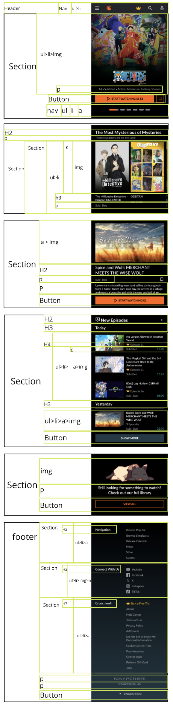

  ### dynamisch deel (bijv menu): 
  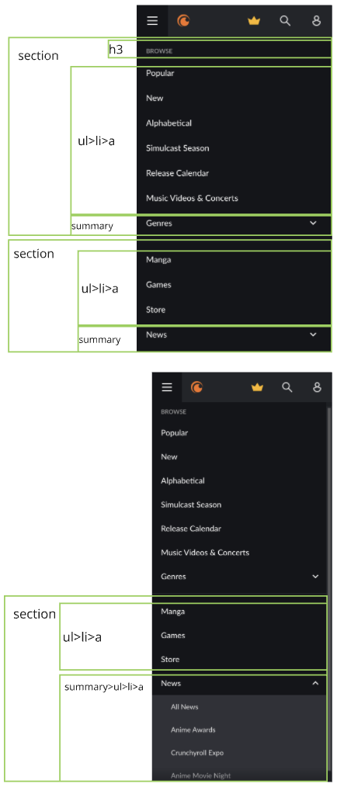

### tweede pagina:
  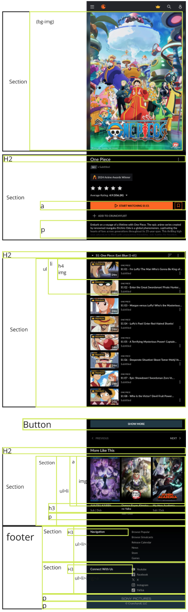

## Voortgang 1 (week 2)

  
uitwerken voor 1e voortgang

  ### Stand van zaken
  hier dit ging goed & dit was lastig (neem ook screenshots op van delen van je website en code)
  - Breakdownschets ging redelijk soepel.

  - In mijn eerste section gebruik ik een carrousel waarin voor elk list-item twee soorten afbeeldingen worden gebruikt: een lang formaat voor telefoons en een breed formaat voor desktops. Moet ik beide afbeeldingen plaatsen?

  Zo ziet het op hun website eruit.

  Lange versie:

  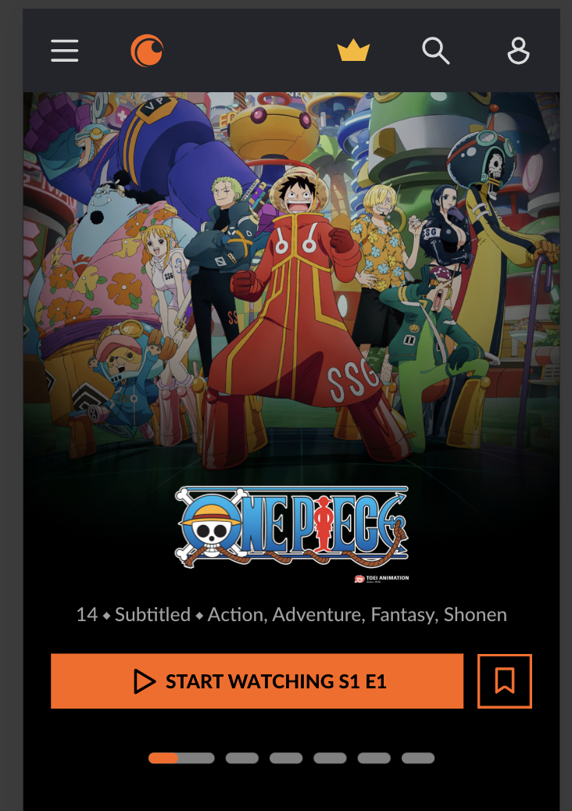

  Breede versie:

  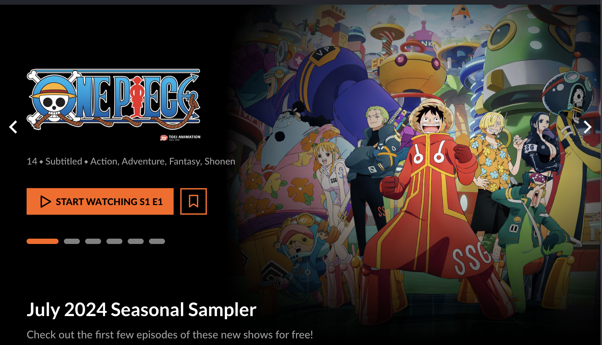

  ### Agenda voor meeting
  samen met je groepje opstellen

  | Splinter                 
  | ---                           
  | Voornamelijk hoe ik de opbouw van de code zie goed mogelijk kan aanpakken

  | Maryam (ik)                 
  | ---                           
  | - In mijn eerste section gebruik ik een carrousel waarin voor elk list-item twee soorten 
    afbeeldingen worden gebruikt: een lang formaat voor telefoons en een breed formaat voor 
    desktops. Moet ik beide afbeeldingen plaatsen?
   - wat kan ik beter gebruiken bij 'start watching' knop een button of een a en die stylen als een button?
   - het gedeelte onder de afbeeldingen 
      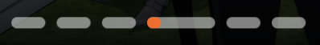

  ### Verslag van meeting
  hier na afloop snel de uitkomsten van de meeting vastleggen

  - de images van de carousel moeten in css geplaatst worden als background-img 
  

## Voortgang 2 (week 3)

  
uitwerken voor 2e voortgang

  ### Stand van zaken
 Ik had wat lastigheden met mijn menu, ik kreeg die namelijk niet open. In de les was het gelukt met hulp, ik had een a met daarin een button wat dus niet samen werkt omdat ze beiden een actie uitvoeren.

  ### Agenda voor meeting
  samen met je groepje opstellen

  | Uri                 
  | ---                           
  | -In mijn hamburgermenu zitten er ontzettend veel steeds herhaalde onderdelen, moet ik die echt allemaal uitwerken?
-Wanneer mag je classes gebruiken?

  | Maryam (ik)                 
  | Waar ik moeite mee heb is mijn carousel, ik krijg mijn bg-img niet te zien en moet nog wat styling bij denk ik
        

  ### Verslag van meeting
    hier na afloop snel de uitkomsten van de meeting vastleggen

  - we hebben samen gekeken naar wat mogelijk is om de bg-img werkend te krijgen

## Toegankelijkheidstest 2/2 (week 4)

  
uitwerken na test in 9e werkgroep

  ### Bevindingen
  - headings langs gaan 
  - elke image heeft een goeie alt bescrijving
  - een light en dark mode toegevoegd
  

## Voortgang 3 (week 4)

  
uitwerken voor 3e voortgang

  ### Stand van zaken
  - scroll-margin-top werkt niet, heb het op verschillende tags geprobeerd maar werkt niet (regel 157, ervoor zorgen dat het niet telkens springt als je klikt op de nav)
  -banner gedeelte een deel va de tekst verbergen.
  -in de eerste carousel met de 3 afbeeldingen zie je een stukje van de tekst niet.

  ### Verslag van meeting
  hier na afloop snel de uitkomsten van de meeting vastleggen
  - niet veel aandacht geven an de margin-top als het niet werkt
  

## Eindgesprek (week 5)

  
uitwerken voor eindgesprek

  ### Je uitkomst - karakteristiek screenshots:
  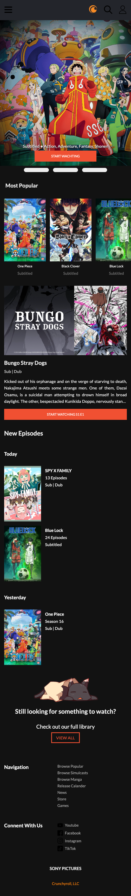
  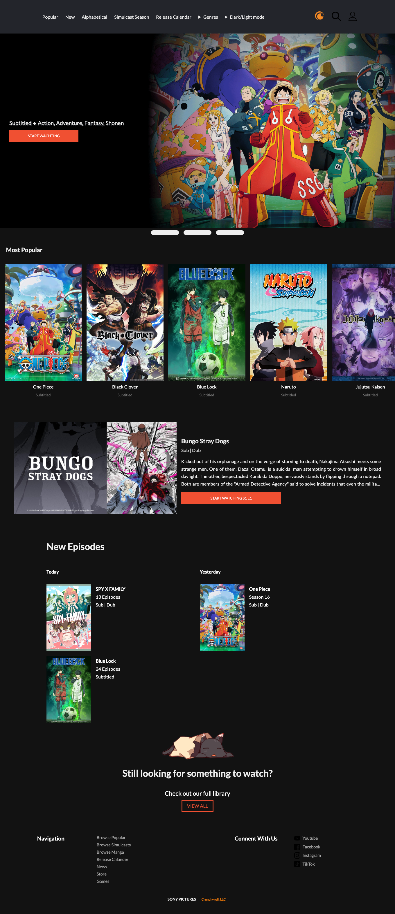
  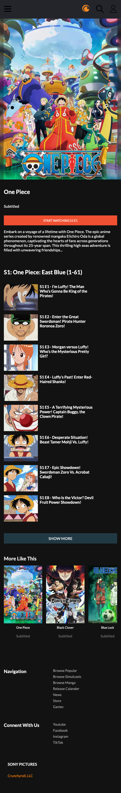
  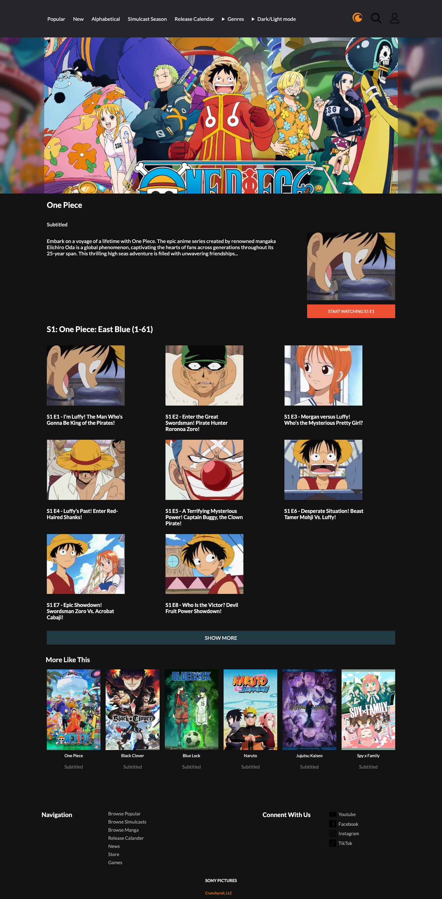

  ### Dit ging goed/Heb ik geleerd: 
  Dit vond ik goed gaan

  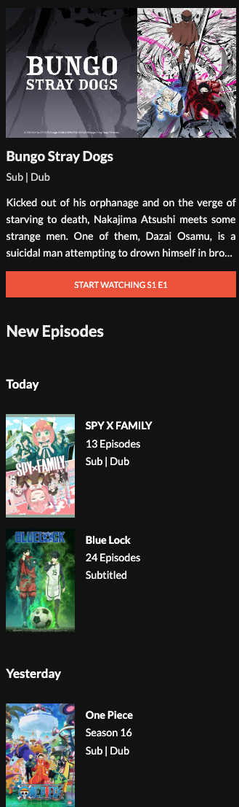
  
  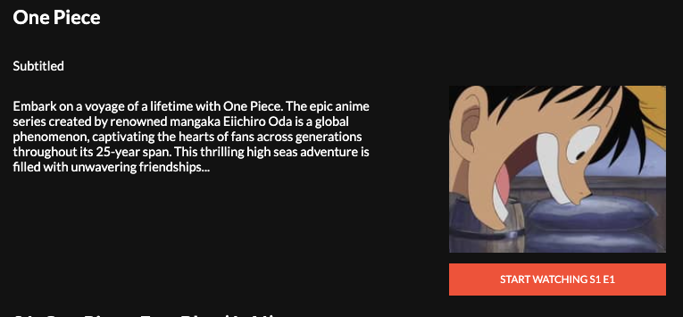

  ### Dit was lastig/Is niet gelukt:
  Hier lukte het mij niet om de gehele afbeelding te laten zien zonder dat het schaalt het inzoomt

  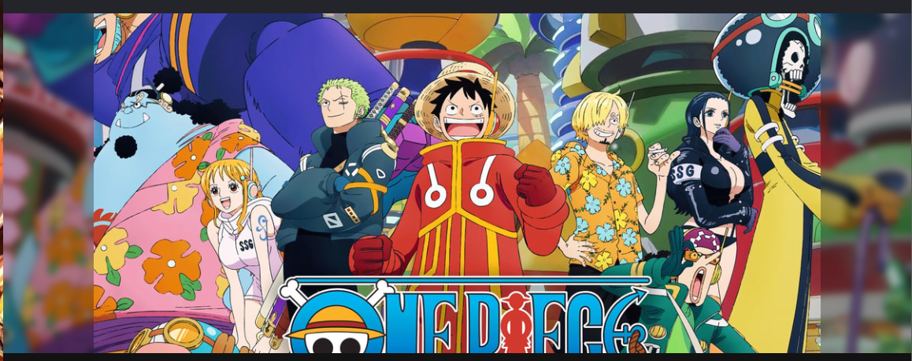

## Bronnenlijst

  
continu bijhouden terwijl je werkt

 - dark/light mode: https://dlo.mijnhva.nl/d2l/common/dialogs/quickLink/quickLink.d2l?ou=609314&type=coursefile&fileId=FED+24-25+-+Blok+1+-+Intro+kleurtjes+met+has+en+lightdark.pdf
- verbergen van een h2 in een section: https://www.a11yproject.com/posts/how-to-hide-content/
- verder heb ik ChatGPT gebruikt voor uitleg en of er betere opties zijn die ik kon gebruiken. de code die ik kreeg teste ik uit in codepen vervolgens heb ik het aangepast zodat het berter bij mijn site past.

